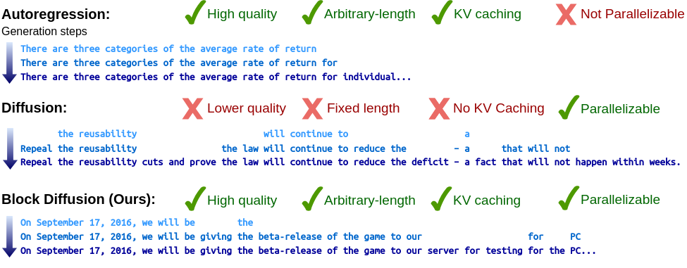

# [Block Diffusion: Interpolating Between Autoregressive and Diffusion Language Models](https://arxiv.org/abs/2503.09573) (ICLR 2025 Oral)
By [Marianne Arriola](https://m-arriola.com/), [Aaron Gokaslan](https://skylion007.github.io), [Justin T Chiu](https://justinchiu.netlify.app), [Zhihan Yang](https://zhihanyang2022.github.io/), [Zhixuan Qi](https://zhixuanqi.com/), [Jiaqi Han](https://hanjq17.github.io/), [Subham Sekhar Sahoo](https://s-sahoo.github.io), [Volodymyr Kuleshov](https://www.cs.cornell.edu/~kuleshov/)

<!-- [](https://colab.research.google.com/drive/18nC6q7dWq154fI1BXPLwmtnS7Zvbrv6p?usp=sharing/) -->
[](https://openreview.net/forum?id=tyEyYT267x)
[](https://m-arriola.com/bd3lms/)
[](https://huggingface.co/collections/kuleshov-group/bd3-lms-67be95f81b96b15fec50d53f)

 

We introduce ***BD3-LMs***, a family of **B**lock **D**iscrete **D**enoising **D**iffusion **L**anguage **M**odels that achieve SOTA likelihoods among diffusion models and enable generation of arbitrary-length sequences. BD3-LMs combine the strengths of autoregressive and diffusion language models by decomposing a token sequence into blocks and performing discrete diffusion within each block. By tuning the block size, we interpolate between autoregressive and diffusion models which introduces a trade-off between quality and sample efficiency. We propose a recipe for building effective BD3-LMs that includes an efficient training algorithm, estimators of gradient variance, and data-driven noise schedules to minimize the variance.

<!-- We provide a demo in this [](https://colab.research.google.com/drive/18nC6q7dWq154fI1BXPLwmtnS7Zvbrv6p?usp=sharing/) notebook. -->


In this repo, we provide:
* **The BD3-LM framework**
  1. Block-autoregressive likelihood parameterization
  2. Data-driven noise schedules to reduce training variance
  3. Arbitrary-length discrete diffusion samplers
* **Baseline implementations**
  1. Autoregressive model [[AR](https://arxiv.org/abs/2406.07524)]
  2. Score Entropy Based Discrete Diffusion [[SEDD](https://arxiv.org/abs/2310.16834)]
  3. Masked Diffusion Language Model [[MDLM](https://arxiv.org/abs/2406.07524)]
  4. Semi-autoregressive Simplex-based Diffusion Language Model [[SSD-LM](https://arxiv.org/pdf/2210.17432)] *(supports sample generation only)*

<a name="code-organization"></a>
## Code Organization
1. ```main.py```: Routines for training and evaluation
2. ```noise_schedule.py```: Noise schedules
3. ```diffusion.py```: Forward/reverse diffusion
4. ```dataloader.py```: Dataloaders
5. ```utils.py```: LR scheduler, logging, `fsspec` handling
6. ```models/```: Network architectures. Supports [DiT](https://arxiv.org/abs/2212.09748) and AR transformer
7. ```configs/```: Config files for datasets/models/noise schedules/LR schedules
8. ```scripts/```: Shell scripts for training/evaluation
    - ``train/``: Training scripts (LM1B, OWT)
    - ``ppl/``: Likelihood evaluation on the pretraining set (LM1B, OWT)
    - ``zs_ppl/``: Zero-shot likelihood evaluation on GPT2 benchmark datasets
    - ``gen_ppl/``: Sample quality (generative perplexity under GPT2)
    - ``var_len/``: Arbitrary-length sequence generation
9. ```ssd-lm/```: SSD-LM codebase
    - ```run_generate_text_batch.sh```: Generates SSD-LM samples
    - ```report_genppl.py```: Reports generative perplexity of SSD-LM samples


<a name="getting_started"></a>

## Getting Started

To get started, create a conda environment containing the required dependencies.

```bash
conda create --name bd3lm python=3.9
conda activate bd3lm
pip install -r requirements.txt
```
While BD3-LMs don't require FlashAttention, evaluating baselines from MDLM require `flash-attn==2.5.6`

Create the following directories to store saved models and slurm logs:
```bash
mkdir outputs watch_folder logs sample_logs
```
and run the training as a batch job:
```bash
sbatch scripts/train/train_owt_bd3lm.sh
```

### Checkpoints

We have uploaded BD3-LMs trained on OpenWebText using block sizes 4, 8, 16 for 1M training steps to HuggingFace 🤗:
[kuleshov-group/bd3-lms](https://huggingface.co/collections/kuleshov-group/bd3-lms-67be95f81b96b15fec50d53f) BD3-LMs are finetuned from an MDLM checkpoint trained on OpenWebText for 850K gradient updates. We release the pretraining checkpoint on HuggingFace: [kuleshov-group/bd3lm-owt-block_size1024-pretrain](https://huggingface.co/kuleshov-group/bd3lm-owt-block_size1024-pretrain)


The MDLM baseline is also found on the HuggingFace:
[kuleshov-group/mdlm-owt](https://huggingface.co/kuleshov-group/mdlm-owt). The AR and SEDD baselines trained on OpenWebText in this [Google Drive folder](https://drive.google.com/drive/folders/16LuuptK7Xfk-vzhQYZBZ0SA-B-BFluau?usp=sharing).

For arbitrary-length sequence generation, we compare with AR, SEDD, and MDLM (supported as an inference-only technique and does not feature a training objective), and SSD-LM. In order to generate sequences longer than the training context size (fixed at 1024 tokens for OWT), we retrained AR and MDLM from Sahoo et. al without artificially injecting BOS/EOS tokens in the context. We also provide these checkpoints on HuggingFace: [kuleshov-group/mdlm-noeos-owt](https://huggingface.co/kuleshov-group/mdlm-noeos-owt), [kuleshov-group/sedd-noeos-owt](https://huggingface.co/kuleshov-group/sedd-noeos-owt), [kuleshov-group/ar-noeos-owt](https://huggingface.co/kuleshov-group/ar-noeos-owt).

## Reproducing Experiments

Below, we describe the steps required for reproducing the experiments in the paper.
Throughout, the main entry point for running experiments is the [`main.py`](./main.py) script.
We also provide sample `slurm` scripts for launching pre-training and downstream fine-tuning experiments in the [`scripts/`](./scripts) directory.


### Generate Arbitrary-Length Sequences

To generate arbitrary-length sequences, set `mode=sample_eval`. Example scripts are provided in `scripts/var_len/var_len*.sh`. Here's an example script using BD3-LM:
#### HuggingFace model
```bash
BLOCK_SIZE=4 # 4, 8, 16
LENGTH=2048 # arbitrary; needs to be a multiple of the block size

python -u main.py \
    loader.eval_batch_size=1 \
    model=small \
    algo=bd3lm \
    algo.T=5000 \
    algo.backbone=hf_dit \
    data=openwebtext-split \
    model.length=$LENGTH \
    block_size=$BLOCK_SIZE \
    wandb=null \
    mode=sample_eval \
    eval.checkpoint_path=kuleshov-group/bd3lm-owt-block_size${BLOCK_SIZE} \
    model.attn_backend=sdpa \
    sampling.nucleus_p=0.9 \
    sampling.kv_cache=true \
    sampling.logdir=$PWD/sample_logs/samples_genlen_bd3lm_blocksize${BLOCK_SIZE}
```

#### Local checkpoint
```bash
BLOCK_SIZE=4 # 4, 8, 16
LENGTH=2048 # arbitrary; needs to be a multiple of the block size

python -u main.py \
    loader.eval_batch_size=1 \
    model=small \
    algo=bd3lm \
    algo.T=5000 \
    data=openwebtext-split \
    model.length=$LENGTH \
    block_size=$BLOCK_SIZE \
    wandb=null \
    mode=sample_eval \
    eval.checkpoint_path=/path/to/checkpoint/bd3lm-owt-block_size${BLOCK_SIZE} \
    model.attn_backend=sdpa \
    sampling.nucleus_p=0.9 \
    sampling.kv_cache=true \
    sampling.logdir=$PWD/sample_logs/samples_genlen_bd3lm_blocksize${BLOCK_SIZE}
```

### Likelihood Evaluation 
To compute test perplexity, use `mode=ppl_eval`. Example scripts are provided in `scripts/ppl/eval_owt_*.sh`. Here's an example evaluation script on OpenWebText:
```bash
BLOCK_SIZE=4 # 4, 8, 16

python -u main.py \
    loader.eval_batch_size=16 \
    model=small \
    algo=bd3lm \
    algo.backbone=hf_dit \
    data=openwebtext-split \
    data.insert_valid_special=False \
    model.length=1024 \
    model.attn_backend=flex \
    block_size=${BLOCK_SIZE} \
    eval.checkpoint_path=kuleshov-group/bd3lm-owt-block_size${BLOCK_SIZE} \
    wandb=null \
    mode=ppl_eval > logs/bd3lm_owt_block_size${BLOCK_SIZE}.log
```

### Training Pipeline
To train BD3-LMs, use `mode=train` (default mode). Example scripts are provided in `scripts/train/train_owt*.sh`. Here's an example training script on OpenWebText:
```bash
BLOCK_SIZE=4 # we recommend 4, 8, or 16. must be a factor of the context length
PRETRAIN_CKPT=kuleshov-group/bd3lm-owt-block_size1024-pretrain # to train from scratch, set to null

python -u main.py \
    loader.global_batch_size=512 \
    loader.eval_global_batch_size=512 \
    loader.batch_size=16 \
    loader.eval_batch_size=16 \
    model=small \
    algo=bd3lm \
    algo.clip_search_widths=[0.5,0.6,0.7,0.8,0.9] \
    data=openwebtext-split \
    model.length=1024 \
    block_size=$BLOCK_SIZE \
    wandb.name=bd3lm-owt-block_size${BLOCK_SIZE} \
    mode=train \
    model.attn_backend=flex \
    training.resample=True \
    training.from_pretrained=$PRETRAIN_CKPT
```
The arguments `loader.batch_size` and `loader.eval_batch_size` allow you to control the batch size per GPU. If `loader.batch_size * num_gpus` is less than the global_batch_size, PyTorch Lightning will resort to gradient accumulation. You can also launch a training job on Slurm using the command: `sbatch scripts/train/train_owt_bd3lm.sh`.

### Acknowledgements
This repository was built off of [MDLM](https://github.com/kuleshov-group/mdlm) and [SEDD](https://github.com/louaaron/Score-Entropy-Discrete-Diffusion).

## Citation
```
@inproceedings{
arriola2025block,
title={Block Diffusion: Interpolating Between Autoregressive and Diffusion Language Models},
author={Marianne Arriola and Aaron Gokaslan and Justin T Chiu and Zhihan Yang and Zhixuan Qi and Jiaqi Han and Subham Sekhar Sahoo and Volodymyr Kuleshov},
booktitle={The Thirteenth International Conference on Learning Representations},
year={2025},
url={https://arxiv.org/abs/2503.09573}
}
```
